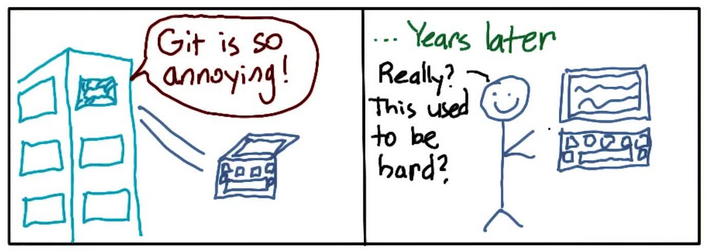

How to Use Git and GitHub
=========================

Notes and reflections on the Udacity course
["How to Use Git and GitHub"](https://eu.udacity.com/course/how-to-use-git-and-github--ud775).

- [summary](notes.md)

Reflections
-----------

- [lesson 1](lesson1_reflections.md)
- [lesson 3](lesson3_reflections.md)
- [lesson 4](lesson4_reflections.md)

Git Tricks for Advanced Users
-----------------------------

- `git config --global merge.conflictstyle diff3` if you don't use a mergetool;
  [diff3 explained](https://blog.nilbus.com/take-the-pain-out-of-git-conflict-resolution-use-diff3/)
- [nice bash prompt](https://gist.github.com/eliotsykes/47516b877f5a4f7cd52f)
- nice git log with
  `alias gitlog='git log --all --graph --decorate'`
- use [interactive staging](https://git-scm.com/book/en/v2/Git-Tools-Interactive-Staging)
  with `git add -i`,
  a flexible and convienent way to stage changes

Git References
--------------

- [git interactive tutorial](https://learngitbranching.js.org/)
- [Git Handbook](https://git-scm.com/book/en/v2/)

Comics
------

xkcd comic on [git](https://xkcd.com/1597/) and [git commit](https://xkcd.com/1296/).

From the udacity course ["How to Use Git and GitHub"](https://eu.udacity.com/course/how-to-use-git-and-github--ud775).
